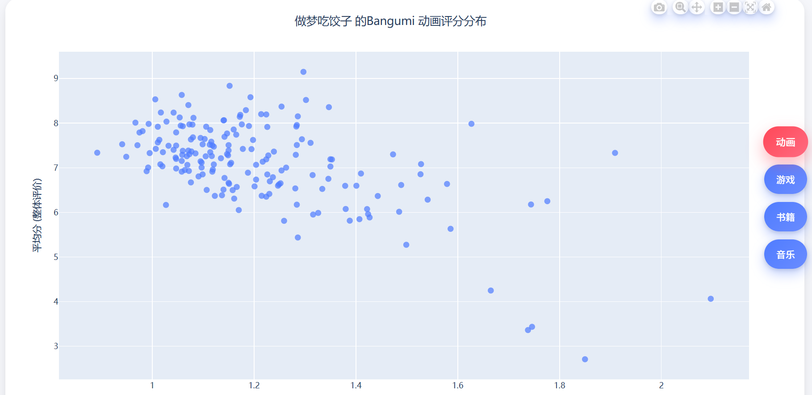
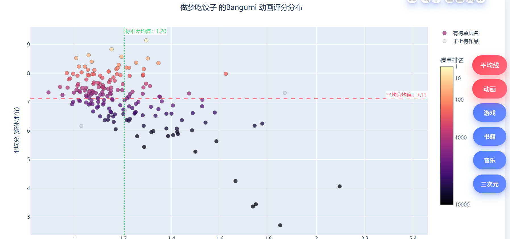

# Bangumi 收藏评分可视化工具 Bangumi Collection Visualization

本项目用于抓取指定 Bangumi 用户的收藏（书籍、动画、音乐、游戏、三次元）评分数据，并生成交互式 HTML 可视化图表，展示每个作品的平均评分与分歧程度（标准差）。


此图片为以前版本,可以到v260116下载此版本的文件

此图片为上个版本,可以到v260120下载此版本的文件
最新版本提供排名与平均分的图像
## ✨ 功能特点

*   **全自动抓取**：自动获取用户收藏列表，支持多线程并发请求。
*   **多维数据分析**：计算每部作品的平均分（质量）和评分标准差（争议度）。
*   **高级交互**：
    *   **类型切换**：支持动画/游戏/书籍/音乐等分类无缝切换。
    *   **平均线开关**：一键显示/隐藏全局平均分和标准差辅助线，状态在切换图表时保持同步。
    *   **详情跳转**：鼠标悬停查看详细数据，点击节点锁定高亮并支持跳转至 Bangumi 详情页。
*   **数据导出**：支持导出 CSV 用于二次分析，或生成静态图片。

---

## ⚙️ 配置与使用

### 1. 运行脚本

运行 `bangumi_auto.py` 并配置以下参数：

| 参数 | 说明 | 默认值 |
|------|------|--------|
| `USER_ID` | 你的 Bangumi 用户 ID（数字或自定义 ID） | **必填** |
| `ACCESS_TOKEN` | API 令牌 ([获取地址](https://next.bgm.tv/demo/access-token)) | **必填** |
| `OUTPUT_CSV` | 输出数据文件名 | `bangumi_data.csv` |
| `OUTPUT_HTML` | 输出网页文件名 | `index.html` |
| `MAX_WORKERS` | 并发线程数 (过高可能触发限流) | `6（建议为4~6）` |

### 2. 生成结果

*   **交互式网页**：脚本运行结束后会生成 `index.html`。
*   **静态图片**（可选）：运行 `bgm_see.py` 读取 CSV 生成静态图片。

---
### 3.使用方法

- 将 `template.html`、`style.css`、`toggle.js` 放在项目目录
- 运行 `bangumi_auto.py` 抓取数据
- 脚本生成 `index.html` 并插入图表和按钮
- 打开 `index.html` 交互查看评分分布
---
## 🎨 前端模板说明 (index.html)

生成的 HTML 基于 `template.html` 模板，结合了 Plotly 图表和原生 JavaScript 交互。

### 页面结构
```html
<body>
    <!-- 侧边栏控制区 -->
    <div class="side">
        <button data-target="Anime">Anime</button>
        <!-- ...其他分类按钮... -->
        <button id="toggle-mean-line">显示/隐藏平均线</button>
    </div>
    
    <!-- 图表展示区 -->
    <div class="chart-area">
        <div id="container-Anime" class="plot active">...</div>
        <div id="container-Game" class="plot">...</div>
    </div>
</body>
```

### 交互逻辑 (`toggle.js`)
前端脚本负责处理复杂的交互行为：

1.  **视图切换与状态同步**：
    *   点击分类按钮时，当前图表滑出，新图表滑入（CSS 动画）。
    *   **自动 Resize**：切换后自动触发 `Plotly.Plots.resize()`，防止图表宽度塌缩。
    *   **辅助线同步**：切换分类时，自动应用当前的“平均线显示/隐藏”状态。
2.  **平均线控制**：
    *   点击“显示/隐藏平均线”按钮，全局控制所有图表的辅助线（`mean-line-x`, `mean-line-y`）可见性。
3.  **图表交互增强**：
    *   **Hover**：悬停放大节点并变色。
    *   **Click**：点击锁定高亮状态，再次点击其他点切换。如果数据包含 URL，点击将打开新窗口跳转。

---

## 📊 图表分析指南

生成的散点图提供了以下维度的信息：

*   **Y轴：平均评分 (Mean)**
    *   越靠上，作品整体评价越高。
*   **X轴：标准差 (Std Dev)**
    *   越靠右，评分分布越离散，说明**争议越大**（两极分化）。
    *   越靠左，评分越集中，大家意见一致。
*   **点的大小/颜色**：
    *   默认统一大小/颜色。
    *   交互时高亮显示。

### 典型分布解读
1.  **右上角 (高分 + 高争议)**：神作但电波对不上的人也多，由于受众筛选通常分数较高但方差大。
2.  **左上角 (高分 + 低争议)**：公认的大众神作，评价一致性高。
3.  **右下角 (低分 + 高争议)**：虽然平均分低，但仍有一部分死忠粉打高分，导致方差大。
4.  **左下角 (低分 + 低争议)**：公认的烂作，大家一致给低分。

---

## 📦 依赖环境

*   Python 3.9+
*   **Requests**: API 请求
*   **Pandas**: 数据清洗与聚合
*   **Plotly**: 生成 HTML 图表配置
*   **Numpy**: 数值计算


---

### 💡 提示
如果遇到图表加载缓慢，通常是因为某些分类下作品数量过多（数千个点），建议在 Python 生成端开启 WebGL 模式 (`render_mode='webgl'`) 以提升性能。
# 更新说明
- 260110更新： 优化CSS，点击散点图可以看到bangumi详细页面。
- 260111更新： 增加鼠标悬浮高亮显示，以及鼠标悬浮手势。
- 260112更新： 重写按钮，重新python和js，支持动画，游戏，书籍，音乐四种散点图，不像是之前版本把元素写死的方法，如果要扩充电视剧也是很方便就能扩充。悬浮窗可以看到投票总人数。
- 260113更新： 散点图标题显示用户昵称，导出python内的模板html作为template.html。
- 260116更新： 扩充三次元（电视剧）散点图，加入标准差均值，平均分均值两条参考线（可开关）。
- 260118更新： 更新了排名热度图，把rank映射到颜色上，悬浮窗也增加了rank。
- 260120更新： 修复了某些情况悬浮窗打开会引起坐标轴抖动以及浏览器崩溃的问题，优化了流畅度。
- 260128更新： 按钮收纳到二级菜单，新增榜单排名与平均分的图像
